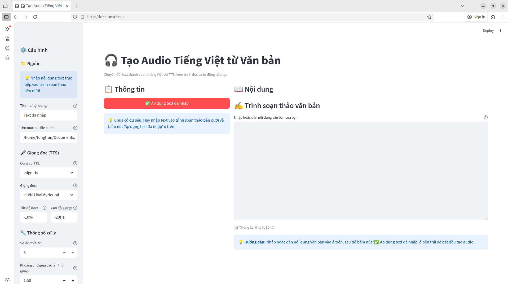

# 🎧 Tạo Audio Tiếng Việt từ Văn bản

Ứng dụng Streamlit để chuyển đổi text trực tiếp thành file audio tiếng Việt (MP3/OGG/M4A). Kèm trình đọc trong app, tự động phát và ghi nhớ vị trí đang nghe (resume).



## Tính năng

- **Nhập text trực tiếp**: Nhập hoặc dán văn bản trực tiếp để tạo một file audio
- **Trình đọc tích hợp**: Phát audio ngay trong ứng dụng với khả năng tự động phát và ghi nhớ vị trí
- **Chất lượng cao**: VBR cho MP3 (≈ ~245–270 kbps trung bình) với ffmpeg
- **Độ tin cậy**: Retry/backoff, throttle, fallback gTTS

## Cài đặt và Chạy ứng dụng

### Cách 1: Chạy trên máy local

#### Yêu cầu hệ thống

**Python 3.8+**

**Thư viện Python:**
```bash
pip install -r requirements.txt
```

Hoặc cài đặt thủ công:
```bash
pip install streamlit pydub gTTS edge-tts
```

**ffmpeg**:
- **Windows**: Tải [ffmpeg](https://ffmpeg.org/download.html), giải nén và thêm vào PATH
- **macOS**: `brew install ffmpeg`
- **Linux**: `sudo apt-get install ffmpeg` (hoặc theo distro của bạn)

#### Chạy ứng dụng

```bash
streamlit run main.py
```

Ứng dụng sẽ chạy tại: http://localhost:8501

---

### Cách 2: Chạy bằng Docker

#### Yêu cầu
- Docker đã được cài đặt trên hệ thống
- Docker Compose (tùy chọn, để dễ quản lý)

#### Xây dựng và chạy Docker container

**Cài đặt Docker:**
- Tham khảo hướng dẫn chính thức tại: https://docs.docker.com/engine/install/
- Chọn hệ điều hành phù hợp (Windows, macOS, Linux) và làm theo hướng dẫn


**Xây dựng image:**
```bash
docker build -t tao-audio-viet .
```

**Chạy container:**
```bash
docker run -d \
  --name tao-audio-viet \
  -p 8501:8501 \
  -v $(pwd)/output_audio:/app/output_audio \
  -v $(pwd)/temp_uploads:/app/temp_uploads \
  tao-audio-viet
```

**Hoặc sử dụng Docker Compose** (file `docker-compose.yml` đã có sẵn):

Chạy:
```bash
docker-compose up -d
```

**Truy cập ứng dụng:**
- Mở trình duyệt và vào: http://localhost:8501

**Dừng container:**
```bash
docker stop tao-audio-viet
docker rm tao-audio-viet
```

**Hoặc với Docker Compose:**
```bash
docker-compose down
```

**Lưu ý:**
- Volume mount (`-v`) để lưu file audio và upload tạm thời ra ngoài container
- File audio sẽ được lưu trong thư mục `output_audio` trên máy host

## Cấu hình TTS

**TTS mặc định**: edge-tts (Microsoft Neural) — cần internet

**Giọng đọc gợi ý**:
- `vi-VN-HoaiMyNeural` (giọng nữ)
- `vi-VN-NamMinhNeural` (giọng nam)
- `vi-VN-HuongHanhNeural` (giọng nữ)

## Sử dụng

1. **Nhập nội dung**: Nhập hoặc dán văn bản vào trình soạn thảo bên dưới

2. **Áp dụng text**: Bấm nút "Áp dụng text đã nhập" để bắt đầu

3. **Xem và chỉnh sửa**: Xem nội dung và chỉnh sửa nếu cần trước khi tạo audio

4. **Tạo audio**: Bấm nút "Tạo audio" để tạo file audio từ text đã nhập

5. **Nghe và tải**: Phát audio ngay trong app hoặc tải về máy tính
